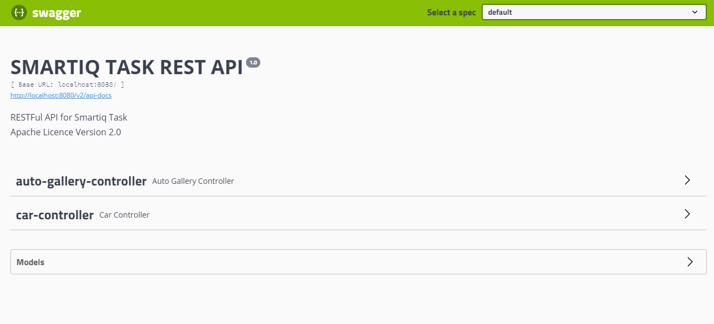

# Smartiq Task
@author: ***Ahmet Yakup ÇETİNKAYA***  
This project was done for spring boot mission of smartiq company.
## Technologies & Tools
- Java 8
- Maven
- Spring Boot 2.3.1
- Swagger2
- ModelMapper
- Lombok
- MySql
## API List
**Port : localhost:8080**
### Car API
- Car List
    - /smartiq/car   ==>   **GET**
    
- One Car
    - /smartiq/car/{carId} ==>     **GET**
    
- Car Gallery Details
    - /smartiq/car/gallery-details/{carId} ==> **GET**
    
- Save Car
    - /smartiq/car ==> **POST**
```
{
    "brand": "Auid",
    "model": "A6",
    "price": 300.000,
    "autoGalleryId": 1
}         
```

- Update Car
    - /smartiq/car ==> **PUT**
```
{
    "id": 1,
    "brand": "Auid",
    "model": "A6",
    "price": 250.000,
    "autoGalleryId": 1
}         
```

- Delete Car
    - /smartiq/car/{carId} ==> **DELETE**
    
### Auto Gallery API
- Auto Gallery List
    - /smartiq/auto-gallery   ==>   **GET**

- One Auto Gallery
    - /smartiq/auto-gallery/{autoGalleryId} ==>     **GET**

- Save Auto Gallery
    - /smartiq/auto-gallery ==> **POST**
```
{
    "galleryName": "Galeri-1"
}         
```

- Update Auto Gallery
    - /smartiq/auto-gallery ==> **PUT**
```
{
    "galleryName": "Galeri-2"
}         
```

- Delete Auto Gallery
    - /smartiq/auto-gallery/{autoGalleryId} ==> **DELETE**
    
## Test Scenarios
- The brand, model and price information of the car cannot be empty.
- The price of the car cannot be less than 0.
- The content ID of the car can not be empty and negative value.
- The gallery id contained in the car must exist in the auto gallery table.
- Second vehicle with the same id cannot be added.
- While updating the car, the id must be specified in the body.
- The number of cars in the gallery increases when a car is added, and decreases when it is deleted.
- When adding the gallery, the name cannot be empty and must be unique.
- The 'carAmount' value in the gallery cannot be given manually, the number changes as the car is added or reduced.
- The user can list the cars and see the gallery details of the selected car.    

## Swagger UI
